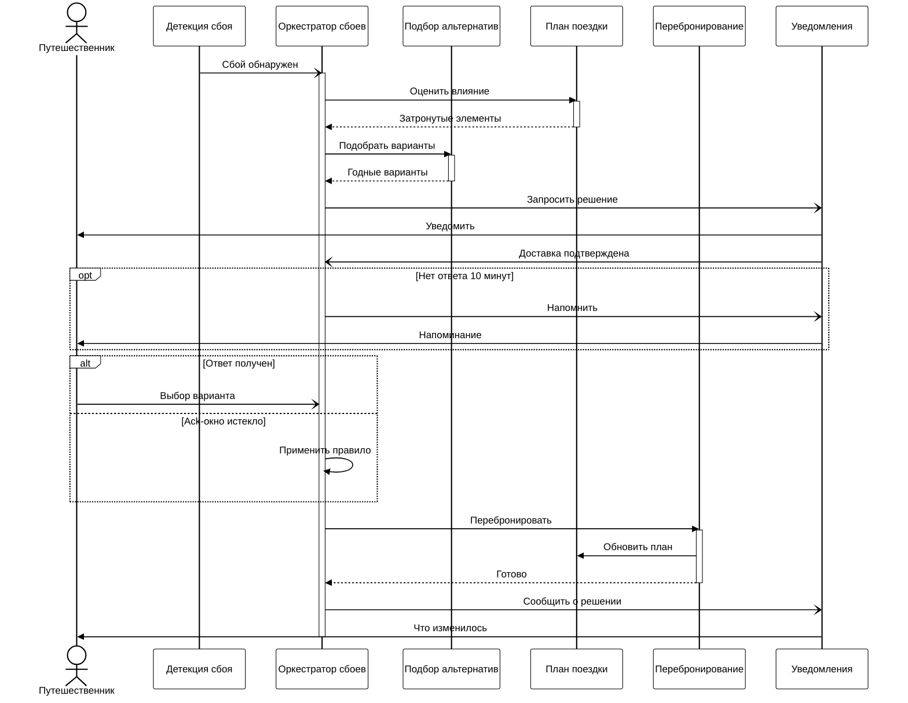

# Динамика сценария: отмена рейса

Сквозной путь одного сбоя: от сообщения провайдера до применённой альтернативы и
обновлённого плана. Диаграмма отвечает на вопрос, которого нет ни на C2, ни в BPMN:
**какие части системы участвуют и в каком порядке они дёргают друг друга**. P-01
показывает шаги процесса и не показывает контейнеров; C2 показывает контейнеры и не
показывает порядка.

Исходная ситуация: у путешественника бронирование из двух сегментов, первый отменён за
шесть часов до вылета, в поездке двое участников, оба затронуты.

## Как читать

| Обозначение | Значение |
|---|---|
| Сплошная линия, закрашенный наконечник | Синхронный вызов: отправитель ждёт ответа |
| Пунктирная линия | Возврат управления с результатом |
| Сплошная линия, открытый наконечник | Асинхронное сообщение: отправитель не ждёт |
| Узкий прямоугольник на линии жизни | Выполнение: участник занят обработкой |
| `opt` | Фрагмент выполняется, если условие истинно |
| `alt` | Взаимоисключающие ветви |

Шина событий линией жизни не показана. Она не участник взаимодействия, а среда доставки:
нарисованная лифлайном, она удваивает каждое асинхронное сообщение и добавляет семь линий,
не отвечающих ни на один вопрос. Асинхронность видна по открытому наконечнику.

## Какому событию соответствует сообщение

Асинхронные сообщения на диаграмме — это каналы шины. Полные имена, ключи
партиционирования и поведение при повторной доставке — в
[каталоге доменных событий](/api/events).

| Сообщение | Канал |
|---|---|
| Сбой обнаружен | `disruption.detected.v1` |
| Запросить решение | `decision.requested.v1` |
| Доставка подтверждена | `notification.delivery.reported.v1` |
| Напомнить | `decision.reminded.v1` |
| Выбор варианта | `decision.submitted.v1` |
| Сообщить о решении | `disruption.resolved.v1` |
| Обновить план | `plan.updated.v1`, публикует `C-PLAN` после записи |

## Что в этом сценарии важно

**Отмена рейса — вина перевозчика**, значит перебронирование вынужденное: тариф
сохраняется, разница не начисляется, шаг авторизации доплаты в `C-REBOOK` пропускается.
Признак вынужденности вычисляется один раз при подборе и едет вместе с выбранным вариантом
(`FR-ALT-06`, `FR-REB-02`).

**Ack-окно отсчитывается не от детекции**, а от момента, когда уведомление сдано в первый
канал лестницы. Этот момент система узнаёт из ответа провайдера канала — потому в цепочке
и есть «Доставка подтверждена». Без него человек, до которого push не дошёл, терял бы часть
своего времени на ответ (`FR-NTF-02`, `FR-DEC-02`).

**Молчание — равноправный исход.** Обе ветви фрагмента `alt` равнозначны: ответ получен
либо ack-окно истекло и решение принимает правило. Напоминание вынесено в `opt`, потому что
оно ожидание не прерывает. Третьего исхода нет.

**Оценка влияния читает план, а не хранит его.** Оркестратор владеет состоянием сбоя, но не
данными маршрута: он спрашивает `C-PLAN` и получает ответ. Новые сегменты после выпуска
билета записывает тоже `C-PLAN`, по запросу от `C-REBOOK` — разделение обосновано в
[C2](./c2-containers.md#оркестратор-владеет-процессом-сервис-плана--маршрутом).

## Групповая поездка

На диаграмме один путешественник, потому что вторая линия жизни ничего бы не добавила:
шаги те же. Отличие в трёх местах, и все три описаны в процессах, а не в архитектуре.
Запрос решения адресуется ответственному за бронирование — это либо сам участник, либо
организатор с действующим на момент выбора мандатом. Общее решение применяется к каждому
участнику отдельной операцией перебронирования, и неуспех у одного не отменяет успех у
остальных. Участник вправе отказаться от общего решения для своего бронирования до
момента выпуска билета (`FR-GRP-02`, `FR-GRP-03`, `FR-GRP-04`).

## Где смотреть подробности

| Вопрос | Где |
|---|---|
| Шаги процесса, таймеры, точки выхода | [P-01. Обработка сбоя рейса](/processes/p01-disruption) |
| Проверки багажа, виз, стыковок и порядок отсева | [P-02. Подбор альтернатив](/processes/p02-alternatives) |
| Сага выпуска, компенсации, точка невозврата | [P-03. Перебронирование](/processes/p03-rebooking) |
| Имена событий, ключи партиционирования, поведение при повторе | [Каталог доменных событий](/api/events) |
| Что происходит, когда внешняя система молчит | [Отказоустойчивость](./resilience.md) |
