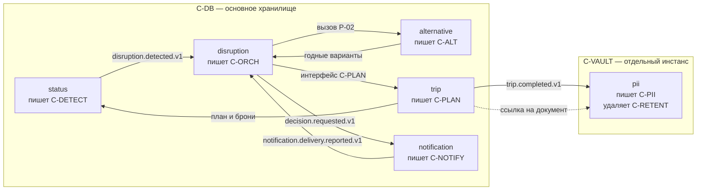
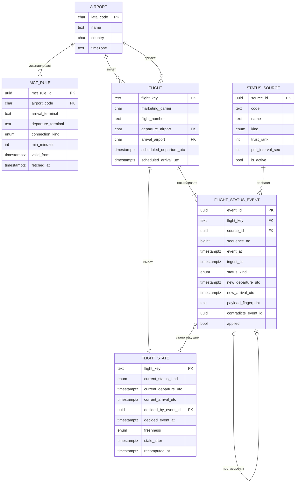
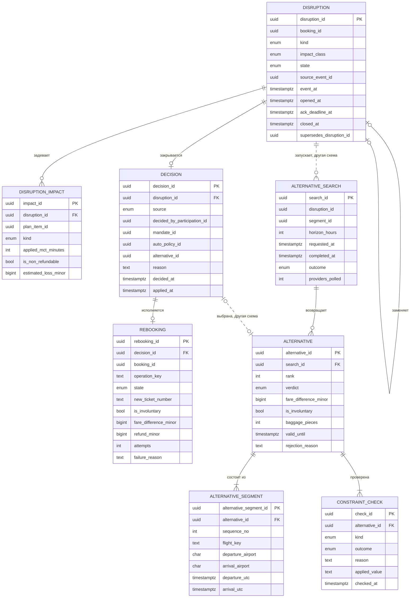

# Модель данных

## Как читать

Источник правды — `db/schema.dbml`. Файл открывается в dbdiagram.io без изменений и служит
для генерации DDL. Диаграммы на этой странице собраны из него, имена таблиц и колонок
совпадают.

Как читаются связи:

| Линия | Что означает |
|---|---|
| Сплошная | Внешний ключ в базе. Целостность обеспечивает СУБД |
| Пунктирная | Связь есть по смыслу, внешнего ключа нет: либо стороны в разных схемах, либо отказ от ключа сделан намеренно |
| Отсутствует | Вторая сторона связи не показана на этой диаграмме. Такие связи собраны в таблице «Связи наружу схемы» после каждой диаграммы |

На диаграммах — **структура**: таблицы, ключи, связи и типы. Всё остальное вынесено, чтобы
схему из тридцати таблиц можно было читать: назначение каждой таблицы — в таблице под
диаграммой, примечания к отдельным колонкам — в DBML, обоснование решений — в разделах
после диаграмм.

Не показаны служебные таблицы: `outbox_event` в схемах `trip` и `disruption` и
`processed_event` в схеме `disruption`. Это механика доставки событий, а не предметная
область, и связей у них нет. Но `processed_event` — не деталь реализации: ею закрывается
условие задания о задержке данных и повторной доставке, поэтому её устройство разобрано
отдельно в разделе
[как устроена дедупликация и outbox](#как-устроена-дедупликация-и-outbox).

## Три правила, на которых стоит модель

Их стоит прочитать до диаграмм: без них половина решений выглядит избыточной.

**1. Всё время хранится в UTC.** Локальное время не хранится нигде. Каждая точка, у
которой есть локальное время, несёт рядом таймзону в формате IANA — `Europe/Moscow`, а не
`UTC+3`. Локальное время вычисляется при отображении. Подробности и цена нарушения — на
странице [время и таймзоны](./time-and-timezones.md).

**2. Статусы рейсов добавляются, а не обновляются.** `status.flight_status_event` — таблица
только на вставку. У каждой записи есть время события у провайдера, время приёма системой,
источник с рангом достоверности и порядковый номер в пределах рейса. Четыре поля вместо
одного нужны, чтобы отсеять дубль, распознать опоздавшее сообщение и разрешить противоречие
между источниками. Текущее состояние лежит в `status.flight_state` и пересчитывается, а не
правится.

**3. Паспортные данные удаляются физически.** Признака `is_deleted` в схеме `pii` нет ни у
одной таблицы. Помеченная удалённой запись остаётся записью, а условие кейса — «нельзя
хранить дольше, чем необходимо». Доказательством удаления служит `pii.purge_record`: она
переживает документ и не содержит его содержимого. Подробности — на странице
[жизненный цикл паспортных данных](./pii-lifecycle.md).

## Карта схем

Шесть схем. Пять живут в основном хранилище `C-DB`, контур паспортных данных — в отдельном
инстансе `C-VAULT`. У каждой схемы ровно один сервис-писатель: граница схемы совпадает с
границей контейнера, это ограничение задано в [C2](../architecture/c2-containers.md).

Стрелки — не внешние ключи, а способ, которым данные пересекают границу схемы: событие
шины или вызов программного интерфейса владельца. **Внешних ключей между схемами нет.**
Целостность таких связей обеспечивает владелец схемы, а не СУБД: иначе таблица владения
из C2 остаётся декларацией, а изменение чужой схемы — обычным делом.

| Схема | Писатель | Что хранит | Таблиц |
|---|---|---|---|
| `trip` | `C-PLAN` | Поездка, участие и роли, мандаты, бронирования, сегменты, план и его версии | 9 |
| `status` | `C-DETECT` | Источники, аэропорты с таймзонами, MCT, поток статусов, вычисленное состояние рейса | 6 |
| `disruption` | `C-ORCH` | Сбой, влияние, решение с основанием, перебронирование | 4 |
| `alternative` | `C-ALT` | Подбор, варианты с TTL, результаты проверок ограничений | 4 |
| `notification` | `C-NOTIFY` | Уведомления, попытки доставки, предпочтения по каналам | 3 |
| `pii` | `C-PII` пишет, `C-RETENT` удаляет | Документы, согласия, доступы, журнал, доказательство удаления | 6 |

## Ссылки таблицы на себя

Четыре таблицы ссылаются сами на себя. На диаграммах это выглядит петлёй, поэтому стоит
сказать, что там происходит.

| Ссылка | Что означает | Требование |
|---|---|---|
| `disruption.supersedes_disruption_id` | Повторный сбой после применённого решения указывает на исходный | `FR-DET-03` |
| `notification.supersedes_notification_id` | Новое уведомление по сбою заместило предыдущее | `FR-NTF-01` |
| `segment.replaced_by_segment_id` | Сегмент заменён при перебронировании | `FR-PLN-01` |
| `flight_status_event.contradicts_event_id` | Сообщение противоречит тому, которое победило | `FR-ING-03` |

Все четыре — одна и та же **цепочка замещения**: новая запись указывает на ту, которую
она заместила. Ссылка всегда направлена назад по времени, на уже существующую запись;
обратной ссылки нет. Замкнуть цепочку нельзя технически: в момент вставки строки, на
которую можно было бы сослаться в другую сторону, ещё не существует. Получается лес
цепочек, а не граф с циклом, и обходится он рекурсивным запросом от последнего звена
к первому.

**Нормальные формы это не нарушает.** Они говорят о функциональных зависимостях между
атрибутами внутри одного отношения, а не о том, в какую таблицу смотрит внешний ключ.
Ссылка на себя — обычный внешний ключ, у которого целевое отношение совпадает с исходным.
Проверка на `disruption`: первичный ключ `disruption_id`, все прочие атрибуты зависят от
него целиком и напрямую, `supersedes_disruption_id` — атрибут именно этого сбоя.
Транзитивных зависимостей и повторяющихся групп нет, 3НФ и БКНФ выполняются.

**Почему не отдельная таблица связей.** Вариант `disruption_chain (predecessor, successor)`
напрашивается, но связь здесь 1:0..1 в обе стороны — у сбоя не больше одного
предшественника и не больше одного преемника — и собственных атрибутов у неё нет.
Выносить такую связь в отдельное отношение нормализация как раз не требует: получилась бы
таблица, у которой обе колонки уникальны, и лишнее соединение при каждом чтении.

**Почему не идентификатор группы.** Можно было дать каждому сбою `root_disruption_id` и
считать случаем все сбои с общим корнем. Так дешевле выбрать всю историю случая одним
запросом, но теряется порядок: кто за кем, если сбой открывался трижды. `FR-DET-03`
говорит о связи с исходным сбоем, а не о принадлежности к группе, поэтому выбрана ссылка.

Ацикличность цепочки — единственное, чего СУБД не проверит сама: обычным ограничением её
не выразить. Держится она правилом «ссылаться можно только на запись, открытую раньше»,
а обеспечивает его единственный сервис-писатель схемы.

## Схема trip. Поездка и план

Писатель `C-PLAN`. Здесь живёт то, что переживает конкретный сбой: кто едет, с кем, по
каким билетам и что запланировано между перелётами.

| Таблица | Что хранит |
|---|---|
| `traveller` | Путешественник. Гражданство для проверки визы и домашняя таймзона. Паспортных полей нет |
| `trip` | Поездка. `completed_at_utc` — фактическое завершение, точка отсчёта срока удержания паспортных данных |
| `trip_participation` | Участие в поездке. Носитель роли: `organizer` или `participant` |
| `organizer_mandate` | Мандат организатора интервалом `granted_at` — `revoked_at` |
| `booking` | Бронирование. `pii_document_ref` — ссылка в контур ПДн, содержимого нет |
| `segment` | Сегмент. `flight_key` — перевозчик, номер и дата вылета в UTC, связь со схемой `status` |
| `plan_version` | Версия плана. `version_no` возрастает без пропусков, `caused_by_disruption_id` — сбой, изменивший план |
| `plan_item` | Элемент плана: сегмент, трансфер, заезд в отель, активность. Версионирован интервалом `valid_from_version` — `valid_to_version` |
| `auto_policy` | Авто-политика со `scope` `trip` или `booking`. `payer_consent_at` пуст — доплата запрещена |

### Решения, которые стоит объяснить

**Роль лежит на участии, а не на путешественнике.** `TRIP_PARTICIPATION.role` — прямая
реализация `FR-GRP-01`. Вопрос «организатор ли этот человек» без указания поездки ответа
не имеет: в семейной поездке он организатор, в рабочей — участник. Роль как колонка
`TRAVELLER` сделала бы второй ответ недостижимым.

**Мандат — интервал, а не флаг.** `FR-GRP-02` проверяет действие мандата **на момент
выбора альтернативы**. Между выбором и разбором сбоя мандат может быть отозван, и признак
`is_active` превратил бы законное решение в нарушение задним числом. Отсюда пара
`granted_at` и `revoked_at` и хранение отозванных мандатов.

**Сегмент не удаляется при перебронировании.** Новый сегмент вставляется, старый получает
`state = replaced` и `replaced_by_segment_id`. Причина та же, что у статусов: сбой
разбирают после того, как он закрыт, и «что было до» — половина разбора.

**План версионируется интервалом версий, а не копией.** `FR-PLN-01` требует сохранить
предыдущую версию плана; копирование всех элементов на каждое изменение дало бы то же
самое, но за пять поездок с тремя сбоями превратило бы таблицу в архив дублей. Текущий
план — строки с `valid_to_version IS NULL`.

**Времена перелёта не дублируются в плане.** У `PLAN_ITEM` с `kind = segment` поля
`starts_at_utc` и `ends_at_utc` пусты: времена читаются из `SEGMENT`. Иначе после
перебронирования появились бы два ответа на вопрос «когда вылет», и рано или поздно они
разошлись бы.

**Приоритет авто-политик — это порядок выборки.** `FR-DEC-02` отдаёт политике бронирования
приоритет над политикой поездки. Реализовано одной таблицей со `scope`: сначала ищется
строка со `scope = booking`, при её отсутствии — со `scope = trip`. Две таблицы или две
пары колонок описывали бы одно правило в двух местах.

**`max_surcharge_minor` — порог, а не второй признак согласия.** `FR-DEC-03` запрещает
авто-политике принимать решение, требующее доплаты, без заранее данного согласия
плательщика **в пределах порога**. Отсюда два условия, оба обязательны: `payer_consent_at`
заполнен и положительная разница тарифа не превышает `max_surcharge_minor`. Значение `0` —
частный случай порога, при котором отсекается любой вариант с доплатой, а не отдельный
флаг «доплата запрещена»: иначе одно правило снова описывалось бы в двух местах.
Отрицательная разница тарифа порогом не ограничена — это возврат, а не доплата. Валюта
порога и валюта варианта должны совпадать, иначе вариант авто-политикой не выбирается.

**Гражданство хранится вне контура ПДн.** `FR-ALT-04` проверяет транзитную визу по
гражданству, а `C-ALT` в таблице доступа `NFR-SEC-01` отсутствует и появиться там не
должен: доступ к контуру выдаётся под конкретную операцию, а подбор выполняется сотни раз
в час. Разделение по смыслу: `citizenship_country` — признак человека, он переживает
поездку и сроком удержания не ограничен; номер документа, срок действия и дата рождения —
реквизиты документа, они в `pii.travel_document` и удаляются вместе с ним.

### Связи наружу схемы

| Колонка | Куда ведёт | Как обеспечивается |
|---|---|---|
| `booking.pii_document_ref` | `pii.travel_document` | Другой инстанс. Разыменовывает только `C-PII`, по правилам `NFR-SEC-01` |
| `plan_version.caused_by_disruption_id` | `disruption.disruption` | Заполняет `C-PLAN` из полезной нагрузки вызова, ссылка на чтение |
| `segment.flight_key` | `status.flight` | Не идентификатор строки, а естественный ключ рейса |

## Схема status. Поток статусов рейсов

Писатель `C-DETECT`. Здесь лежит ответ на условие «данные о рейсах приходят с задержкой».
Таблиц шесть, и четыре из них существуют ровно потому, что источники врут, опаздывают и
противоречат друг другу.

| Таблица | Что хранит |
|---|---|
| `status_source` | Источник статусов: агрегатор, push перевозчика, служебная рассылка. `trust_rank` решает противоречия |
| `airport` | Аэропорт. `timezone` в формате IANA — единственный источник локального времени в системе |
| `mct_rule` | Минимальное время пересадки. Снимок справочника ограничений с `fetched_at` |
| `flight` | Рейс. Первичный ключ — `flight_key`, тот же, которым партиционируется поток статусов |
| `flight_status_event` | Сообщение о статусе. Только на вставку. `applied` ложен у опоздавших и проигравших по рангу |
| `flight_state` | Вычисленное текущее состояние рейса. `stale_after` — порог свежести, после него неопределённость |

### Решения, которые стоит объяснить

**Статус принадлежит рейсу, а не сегменту.** Один рейс — сотни бронирований. Если хранить
статус на сегменте, каждое сообщение источника пришлось бы размножить на все затронутые
брони ещё до дедупликации, и дубли ловились бы сотнями копий вместо одной. Сегмент связан
с рейсом через `flight_key`, и тот же ключ партиционирует `flight.status.received.v1`,
поэтому порядок сообщений одного рейса гарантирован шиной.

**Сообщения только добавляются.** Ранее принятое сообщение не изменяется и не удаляется
(`FR-ING-02`). Причина не в аккуратности, а в том, что сбой разбирают задним числом:
вопрос «почему система решила, что рейс отменён, если он вылетел» без истории сообщений
не имеет ответа.

**Четыре поля вместо одного «когда».** Каждое закрывает свой случай:

| Поле | Что без него ломается |
|---|---|
| `event_at` | Решение принимается по времени приёма, и сообщение, пролежавшее в очереди провайдера десять минут, выигрывает у более свежего |
| `ingest_at` | Нечем измерить лаг провайдера (`NFR-OBS-02`) и нечем отличить «источник молчит» от «ничего не происходит» |
| `source_id` с `trust_rank` | Противоречие между агрегатором и push перевозчика разрешается случайно |
| `sequence_no` | Два сообщения с одинаковым `event_at` не упорядочены, а повторная доставка неотличима от нового статуса |

**`sequence_no` возрастает в пределах рейса, а не глобально.** Порядок нужен ровно внутри
одного рейса — это же и есть ключ партиционирования. Глобальный счётчик потребовал бы
единой точки выдачи номеров при потоке 2000 сообщений в секунду (`NFR-SCAL-01`).

**Противоречие сохраняется, а не затирается.** Проигравшее сообщение остаётся с
`applied = false` и заполненным `contradicts_event_id`. `FR-ING-03` требует сохранить факт
противоречия: это входные данные для пересмотра рангов источников.

**`flight_state` — производная таблица.** Текущий статус можно каждый раз вычислять из
потока сообщений, но при 500 тысячах активных бронирований это перебор истории на каждое
чтение. Состояние материализовано и пересчитывается при поступлении сообщения, которое его
меняет. `decided_by_event_id` указывает, какое именно сообщение победило, — без него
материализация превращается в непроверяемое утверждение.

**Свежесть — отдельное состояние, а не отсутствие новостей.** `stale_after` считается как
максимум из 15 минут и трёх интервалов опроса источника (`NFR-REL-04`). По его истечении
рейс переходит в неопределённость. Прямой ответ на строку чек-листа: молчание источника не
означает «изменений нет».

**`airport.timezone` — IANA, а не смещение.** Смещение меняется дважды в год, и рейс,
вылетающий 25 октября, посчитается неверно. Подробнее — на странице
[время и таймзоны](./time-and-timezones.md).

**MCT — снимок справочника, а не вычисление.** Система MCT не вычисляет (это записано в
глоссарии), но и синхронно спрашивать справочник на каждое сообщение при детекции
misconnect нельзя — не выдержит ни поток, ни `NFR-REL-03`. Значение, применённое при
детекции конкретного сбоя, сохраняется в `disruption.disruption_impact`: справочник может
измениться, а разбирать решение будут по тому правилу, которое действовало.

### Связи наружу схемы

| Колонка | Куда ведёт | Как обеспечивается |
|---|---|---|
| `flight.flight_key` ← `trip.segment.flight_key` | `trip` | Естественный ключ. `C-DETECT` отслеживает только рейсы, на которые есть активные сегменты, список получает через интерфейс `C-PLAN` |
| Наружу из схемы | `disruption` | Событие `disruption.detected.v1` со ссылкой на сообщение, породившее детекцию. Записей в чужие схемы `C-DETECT` не делает |

## Схемы disruption и alternative. Сбой, решение, альтернативы

Две схемы на одной диаграмме: `disruption` ведёт `C-ORCH`, `alternative` — `C-ALT`.
Разведены они потому, что у подбора своя связка внешних систем и свой режим отказа, но
читаются вместе: подбор запускается сбоем и возвращается в решение.

| Таблица | Что хранит |
|---|---|
| `disruption.disruption` | Сбой по бронированию. `supersedes_disruption_id` связывает повторный сбой с исходным |
| `disruption.disruption_impact` | Затронутый элемент плана. `applied_mct_minutes` — снимок правила на момент детекции |
| `disruption.decision` | Решение. `source` обязателен: путешественник, организатор, авто-политика, оператор |
| `disruption.rebooking` | Перебронирование. `operation_key` защищает от повторного выпуска, деньги здесь же |
| `alternative.alternative_search` | Подбор. `outcome` различает «годных нет» и «справочник недоступен» |
| `alternative.alternative` | Вариант. `valid_until` — TTL, `verdict` — годен, годен с условием, отклонён |
| `alternative.alternative_segment` | Сегмент предложенного маршрута. Маршрут может быть из нескольких рейсов |
| `alternative.constraint_check` | Результат одной проверки: MCT, багаж, виза, таймзоны, разница тарифа |

### Решения, которые стоит объяснить

**Сбой привязан к бронированию, а не к рейсу и не к поездке.** Отменённый рейс — это один
факт и сотни разных последствий: у кого-то он последний сегмент, у кого-то разрушенная
стыковка, у кого-то пропавший заезд в отель. Бронирование — минимальная единица, для
которой ответ на вопрос «что теперь делать» одинаков. Отсюда же ключ партиционирования
`disruption.detected.v1` (`NFR-SCAL-02`).

**Повторный сбой — колонка, а не таблица.** `FR-DET-03`: статус, поступивший после
применённого решения и делающий его неисполнимым, открывает новый сбой, связанный с
исходным. Это обычная строка `DISRUPTION` с заполненным `supersedes_disruption_id`.
Отдельная таблица потребовала бы дублировать весь жизненный цикл ради одной ссылки.

**`applied_mct_minutes` хранится в последствии.** Справочник ограничений меняется, а
разбирать решение будут через месяц. Значение, по которому стыковка признана разрушенной,
лежит рядом с самим последствием, а не берётся заново из схемы `status`.

**У решения обязательно есть основание.** `NFR-OBS-01` требует, чтобы для 100 % решений
было известно, кто и на каком основании решил. `source` принимает четыре
взаимоисключающих значения, и заполнена та из трёх ссылок, которая ему соответствует.
`mandate_id` сохраняется именно тот, что действовал в момент выбора: `FR-GRP-02` проверяет
мандат на момент решения, а не на момент разбора.

**Отказ участника от общего решения не требует своей таблицы.** `FR-GRP-03` описывает
ситуацию, когда участник решает сам вместо организатора. Поскольку сбой уже привязан к
бронированию, а бронирование — к одному участию, это `DECISION.source = traveller` вместо
`organizer`.

**Деньги живут на перебронировании.** `fare_difference_minor`, `refund_minor` и
`is_involuntary` возникают и умирают вместе с выпуском билета. `FR-REB-02` различает два
случая: при вынужденном перебронировании тариф сохраняется и разница не начисляется, при
добровольной смене положительная разница авторизуется до выпуска, а отрицательная порождает
возврат после. `is_involuntary` — не украшение, а развилка денежной ветки.

**`operation_key` — не идентификатор строки.** Составлен из `disruption_id` и `booking_id`.
Повторный вызов провайдера с тем же ключом не выпускает второй билет (`FR-REB-01`). Это
единственная защита, которая работает, когда ответ провайдера потерялся по сети, а сам
вызов прошёл.

**У альтернативы есть срок годности.** Провайдер не держит место, пока путешественник
думает. `valid_until` отсекает варианты, которые уже нельзя выпустить, до того, как они
попадут в уведомление или в авто-политику.

**Результат каждой проверки — отдельная строка.** `FR-ALT-07` требует сохранять исход и
причину по каждой проверке отдельно, а не сводить их к одному признаку. Практическая польза
видна при эскалации: `FR-DEC-04` отдаёт оператору перечень отклонённых вариантов **с
причинами отклонения**, и без пяти строк на вариант этот перечень нечем наполнить.
`applied_value` хранит то, что сказал справочник: MCT в минутах, требуемый тип визы, норму
багажа.

**`outcome` различает «годных нет» и «справочник недоступен».** Для процесса P-01 оба
случая ведут на эскалацию и неразличимы. Для наблюдаемости различать обязательно: первое —
нормальная работа в плохой день, второе — деградация, которую надо чинить.

**Как устроена дедупликация и outbox.** Двух таблиц нет на диаграмме, но именно они
делают исполнимым условие «данные о рейсах приходят с задержкой» при доставке не менее
одного раза.

`disruption.processed_event` — таблица обработанных событий компонента `C-ORCH-INBOX`.
Первичный ключ — сам ключ идемпотентности: вставка с конфликтом и есть обнаружение дубля,
одна операция вместо пары «прочитать, потом записать». Ключ берётся из
[каталога событий](/api/events#повторная-доставка) и составляется вместе с именем канала,
чтобы значения разных типов не столкнулись:

| Событие, которое читает оркестратор | Из чего собран ключ |
|---|---|
| `disruption.detected.v1` | `disruption_id` |
| `decision.submitted.v1` | `disruption_id` и `decision_id` |
| `notification.delivery.reported.v1` | `notification_id`, канал, статус доставки |

`expires_at` держит запись дольше, чем окно повторной доставки шины, после чего строка
удаляется фоновой задачей — иначе таблица растёт вечно. Срок принят как допущение: 7
суток. Порог выбран из двух соображений: он больше окна повторной доставки шины и больше
суток, за которые сбой обязан получить завершающее состояние (`NFR-REL-05`), — то есть
дубль не может прийти после того, как запись о нём исчезла.

Сырой поток статусов через эту таблицу не проходит: сообщение источника сохраняется
целиком в `status.flight_status_event`, и дедупликацию там обеспечивает уникальный индекс
по источнику, рейсу, времени события и типу статуса. Отдельная таблица ключей была бы
второй копией того, что уже лежит в самой записи.

`outbox_event` в схемах `trip` и `disruption` — транзакционный outbox. Событие пишется
той же транзакцией, что и изменение состояния, `published_at` пуст, пока релей не отправил
сообщение. Релей может отправить дубль — это нормально, потому что каждый потребитель
идемпотентен; чего он не может — отправить событие о том, чего не произошло. Общая таблица
на две схемы означала бы двух писателей, поэтому структура повторена в обеих.

**Маршрут альтернативы может состоять из нескольких рейсов.** Отсюда
`ALTERNATIVE_SEGMENT`. `FR-ALT-02` требует проверить MCT **по всем стыковкам получившегося
маршрута**, а при перебронировании через другой хаб стыковок появляется больше, чем было.
Модель «одна альтернатива — один рейс» не дала бы проверить то, что требование называет.

### Связи наружу схем

| Колонка | Куда ведёт | Как обеспечивается |
|---|---|---|
| `disruption.booking_id`, `disruption.source_event_id` | `trip`, `status` | Заполняются из события детекции. `C-ORCH` читает план через интерфейс `C-PLAN` |
| `disruption_impact.plan_item_id` | `trip` | Результат оценки влияния. `C-ORCH` в план не пишет: `P-03.T7` — вызов интерфейса |
| `decision.alternative_id` | `alternative` | Единственная связь из схемы сбоя в схему подбора |
| `alternative_search.disruption_id`, `.segment_id` | `disruption`, `trip` | Заполняются из параметров вызова P-02 |

## Схемы pii и notification. Паспортные данные и уведомления

Две схемы на одной диаграмме, и **связей между ними нет** — это не упущение, а свойство
модели: `C-NOTIFY` ничего не знает о паспортных данных, контур ПДн ничего не знает об
уведомлениях. Обе общаются только со схемами `disruption` и `trip`.

| Таблица | Что хранит |
|---|---|
| `pii.travel_document` | Документ. Поля зашифрованы, `mask` — последние четыре цифры, `retention_due_at` — срок удержания |
| `pii.consent` | Согласие на обработку с версией текста и временем получения |
| `pii.access_grant` | Выданный доступ: субъект, основание, срок. Оператору не больше 60 минут |
| `pii.document_access_log` | Журнал доступа. Неизменяем, `document_id` хранится значением — журнал переживает документ |
| `pii.purge_run` | Прогон удаления. `overdue_left_count` больше нуля поднимает алерт о расхождении |
| `pii.purge_record` | Доказательство удаления. Содержимого документа нет и не было |
| `notification.notification` | Уведомление. `supersedes_notification_id` — по одному сбою активно не более одного |
| `notification.delivery_attempt` | Попытка доставки по каналу. `sent_at` и `confirmed_at` — разные вещи |
| `notification.channel_preference` | Предпочтения по каналам и тихие часы со своей таймзоной |

### Решения, которые стоит объяснить

**У `document_access_log` и `purge_record` нет внешнего ключа на `travel_document`.** Это
главное техническое следствие требования удалять физически. Внешний ключ дал бы выбор из
двух одинаково плохих исходов: либо удаление документа блокируется, пока есть записи
журнала, — и тогда данные хранятся дольше срока, либо каскад сносит вместе с документом и
доказательство того, что он был удалён. Поэтому `document_id` хранится там как значение.
Журнал переживает документ, а по `NFR-SEC-02` живёт три года.

**На диаграмме `channel_preference` ни с чем не соединена, и это верно.** Её
единственная связь — `traveller_id` в схему `trip`: предпочтения по каналам принадлежат
человеку, а не уведомлению. Внутри своей схемы связывать её не с чем, а межсхемные связи
на диаграммах не рисуются — они собраны в таблице после диаграммы. Уведомление и
предпочтение встречаются не в модели, а в момент отправки: `C-NOTIFY` строит лестницу
каналов из предпочтений того участия, которому адресовано уведомление.

**Признака `is_deleted` нет ни у одной таблицы контура.** Помеченная удалённой запись
остаётся записью: её видно в резервной копии, её достанет разработчик с правами на схему,
её вернёт восстановление. Чек-лист называет отдельным способом провалить решение вариант
«паспортные данные в основной базе, но зашифрованно» — признак удаления вместо удаления из
той же серии.

**`retention_due_at` хранится, а не вычисляется.** Поездка продлевается: возвратный сегмент
перенесён, возврат не закрыт, перебронирование не завершено. В этих случаях `P-04` переносит
срок, и переносится именно значение в записи. Вычисляемый на лету срок означал бы, что дата
удаления зависит от того, кто и когда задал вопрос.

**`mask` хранится отдельной колонкой.** Чтобы показать человеку последние четыре цифры, не
нужно расшифровывать номер. Без отдельной колонки каждый показ карточки бронирования стал
бы обращением к контуру и записью в журнал доступа — журнал перестал бы что-либо значить.

**`access_grant` и `document_access_log` — разные таблицы.** Первое разрешение, второе
факт. `FR-PII-05` выдаёт оператору доступ по конкретному сбою с обоснованием и на срок,
`FR-PII-04` фиксирует каждое обращение. Одна таблица на двоих не позволила бы отличить
выданный и не использованный доступ от использованного.

**`purge_run.overdue_left_count` — источник `pii.purge.mismatch.v1`.** Отчёт об удалении за
произвольный период (`NFR-COMP-01`) строится по `purge_record`, а не по документам, которых
уже нет.

**Одно активное уведомление на сбой — ссылка, а не пересоздание.** Новое уведомление
заменяет предыдущее через `supersedes_notification_id` (`FR-NTF-01`). История остаётся:
`FR-NTF-04` даёт путешественнику, не получившему уведомление вовремя, увидеть сбой и
принятое решение при следующем входе.

**У попытки доставки два времени.** `sent_at` и `confirmed_at`. `FR-NTF-02` прямо говорит:
факт отправки подтверждением не считается, переход к следующему каналу лестницы происходит
по подтверждению или по его отсутствию. Одна колонка сделала бы это требование
невыполнимым.

**`ladder_step` — номер, а не «текущий канал».** Нужна история: какой канал был первым,
какой вторым, на каком лестница исчерпалась. Признак «текущий» на уведомлении дал бы только
последнее состояние.

**Тихие часы несут свою таймзону.** Путешественник задаёт их в своём времени, а находиться
в этот момент может в другой точке. Ограничения по каналам и времени не применяются к сбоям
с `impact_class = infeasible` (`FR-NTF-01`) — это правило процесса, в модели оно не
хранится.

### Связи наружу схем

| Колонка | Куда ведёт | Как обеспечивается |
|---|---|---|
| `travel_document.traveller_id` | `trip.traveller` | Другой инстанс. Обратная ссылка живёт в `trip.booking.pii_document_ref` |
| `access_grant.disruption_id`, `document_access_log.disruption_id` | `disruption` | Основание доступа. Проверяется `C-PII` при выдаче |
| `notification.disruption_id`, `.participation_id` | `disruption`, `trip` | Заполняются из полезной нагрузки `decision.requested.v1` |
