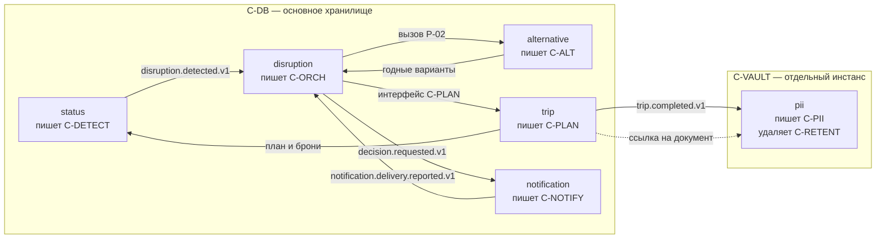
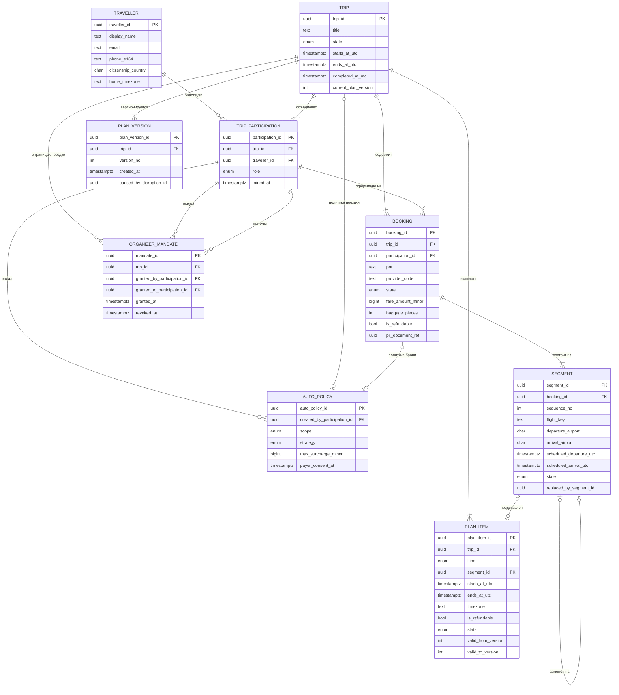
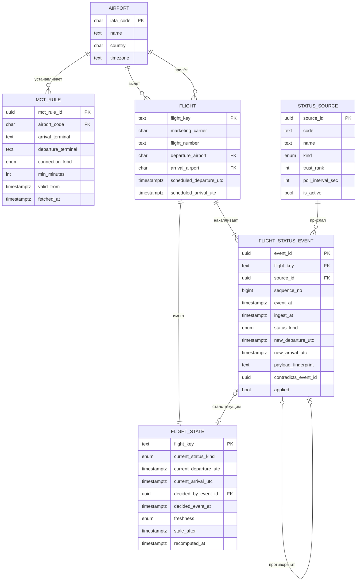
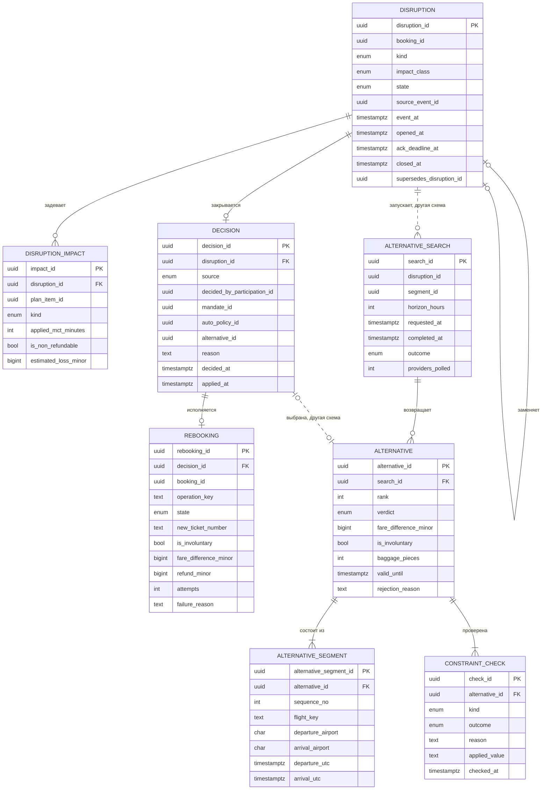
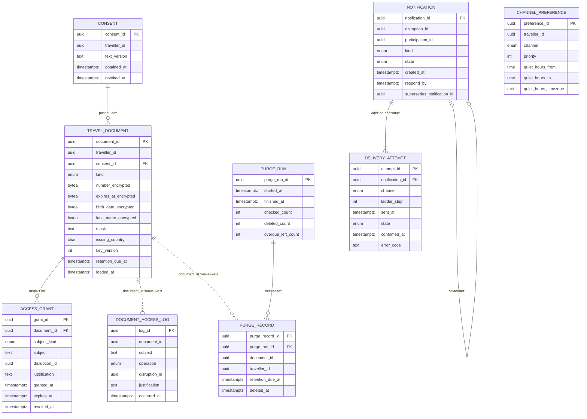

# Модель данных

## Как читать

Источник правды — `db/schema.dbml`: файл открывается в dbdiagram.io без изменений и служит
для генерации DDL. Диаграммы на этой странице собраны из него, имена таблиц и колонок
совпадают.

| Линия на диаграмме | Что означает |
|---|---|
| Сплошная | Внешний ключ в базе, целостность обеспечивает СУБД |
| Пунктирная | Связь есть по смыслу, внешнего ключа нет: стороны в разных схемах либо отказ сделан намеренно |
| Отсутствует | Вторая сторона не показана на этой диаграмме. Такие связи собраны в таблице «Связи наружу схемы» под каждой |

На диаграммах только структура: таблицы, ключи, связи и типы. Назначение каждой таблицы —
в таблице под диаграммой, примечания к колонкам — в DBML, обоснование решений — в разделах
после диаграмм. Иначе схему из тридцати таблиц не прочитать.

Не показаны служебные таблицы `outbox_event` и `processed_event`: это механика доставки
событий, связей у них нет. Устройство `processed_event` при этом разобрано отдельно в
разделе [дедупликация и outbox](#дедупликация-и-outbox) — ею закрывается условие задания о
задержке данных и повторной доставке.

## Три правила, на которых стоит модель

Без них половина решений выглядит избыточной.

**Всё время хранится в UTC.** Локальное время не хранится нигде: каждая точка несёт рядом
таймзону в формате IANA — `Europe/Moscow`, а не `UTC+3`. Локальное время вычисляется при
отображении. Цена нарушения — на странице [время и таймзоны](./time-and-timezones.md).

**Статусы рейсов добавляются, а не обновляются.** `status.flight_status_event` — таблица
только на вставку, с временем события у провайдера, временем приёма, источником и его
рангом и порядковым номером в пределах рейса. Четыре поля вместо одного нужны, чтобы
отсеять дубль, распознать опоздавшее сообщение и разрешить противоречие между источниками.
Текущее состояние лежит в `status.flight_state` и пересчитывается.

**Паспортные данные удаляются физически.** Признака `is_deleted` в схеме `pii` нет ни у
одной таблицы: помеченная удалённой запись остаётся записью. Доказательством удаления
служит `pii.purge_record` — она переживает документ и не содержит его содержимого.
Подробности — в [жизненном цикле](./pii-lifecycle.md).

## Карта схем

Шесть схем. Пять живут в основном хранилище `C-DB`, контур паспортных данных — в отдельном
инстансе `C-VAULT`. У каждой схемы ровно один сервис-писатель: граница схемы совпадает с
границей контейнера, это ограничение задано в [C2](../architecture/c2-containers.md).

Стрелки — не внешние ключи, а способ, которым данные пересекают границу схемы: событие
шины или вызов программного интерфейса владельца. **Внешних ключей между схемами нет.**
Целостность таких связей обеспечивает владелец схемы, а не СУБД: иначе таблица владения
из C2 остаётся декларацией, а изменение чужой схемы — обычным делом.

| Схема | Писатель | Что хранит | Таблиц |
|---|---|---|---|
| `trip` | `C-PLAN` | Поездка, участие и роли, мандаты, бронирования, сегменты, план и его версии | 9 |
| `status` | `C-DETECT` | Источники, аэропорты с таймзонами, MCT, поток статусов, вычисленное состояние рейса | 6 |
| `disruption` | `C-ORCH` | Сбой, влияние, решение с основанием, перебронирование | 4 |
| `alternative` | `C-ALT` | Подбор, варианты с TTL, результаты проверок ограничений | 4 |
| `notification` | `C-NOTIFY` | Уведомления, попытки доставки, предпочтения по каналам | 3 |
| `pii` | `C-PII` пишет, `C-RETENT` удаляет | Документы, согласия, доступы, журнал, доказательство удаления | 6 |

## Ссылки таблицы на себя

Четыре таблицы ссылаются сами на себя, и на диаграммах это выглядит петлёй.

| Ссылка | Что означает | Требование |
|---|---|---|
| `disruption.supersedes_disruption_id` | Повторный сбой после применённого решения указывает на исходный | `FR-DET-03` |
| `notification.supersedes_notification_id` | Новое уведомление по сбою заместило предыдущее | `FR-NTF-01` |
| `segment.replaced_by_segment_id` | Сегмент заменён при перебронировании | `FR-PLN-01` |
| `flight_status_event.contradicts_event_id` | Сообщение противоречит тому, которое победило | `FR-ING-03` |

Все четыре — одна и та же цепочка замещения: новая запись указывает на ту, которую она
заместила. Ссылка всегда направлена назад по времени, обратной нет, замкнуть цепочку
нельзя технически — в момент вставки строки, на которую можно было бы сослаться в другую
сторону, ещё не существует. Получается лес цепочек, а не граф с циклом; обходится
рекурсивным запросом от последнего звена к первому.

Ацикличность — единственное, чего СУБД не проверит сама. Держится она правилом «ссылаться
можно только на запись, открытую раньше», а обеспечивает его единственный сервис-писатель
схемы.

## Схема trip. Поездка и план

Писатель `C-PLAN`. Здесь живёт то, что переживает конкретный сбой: кто едет, с кем, по
каким билетам и что запланировано между перелётами.

| Таблица | Что хранит |
|---|---|
| `traveller` | Путешественник. Гражданство для проверки визы и домашняя таймзона. Паспортных полей нет |
| `trip` | Поездка. `completed_at_utc` — фактическое завершение, точка отсчёта срока удержания паспортных данных |
| `trip_participation` | Участие в поездке. Носитель роли: `organizer` или `participant` |
| `organizer_mandate` | Мандат организатора интервалом `granted_at` — `revoked_at` |
| `booking` | Бронирование. `pii_document_ref` — ссылка в контур ПДн, содержимого нет |
| `segment` | Сегмент. `flight_key` — перевозчик, номер и дата вылета в UTC, связь со схемой `status` |
| `plan_version` | Версия плана. `version_no` возрастает без пропусков, `caused_by_disruption_id` — сбой, изменивший план |
| `plan_item` | Элемент плана: сегмент, трансфер, заезд в отель, активность. Версионирован интервалом `valid_from_version` — `valid_to_version` |
| `auto_policy` | Авто-политика со `scope` `trip` или `booking`. `payer_consent_at` пуст — доплата запрещена |

### Решения, которые стоит объяснить

| Решение | Почему так |
|---|---|
| Роль лежит на `trip_participation`, а не на `traveller` | `FR-GRP-01`: в семейной поездке человек организатор, в рабочей участник. Роль на путешественнике сделала бы второй ответ недостижимым |
| Мандат — интервал `granted_at` — `revoked_at`, а не флаг | `FR-GRP-02` проверяет мандат на момент выбора. Признак `is_active` превратил бы законное решение в нарушение задним числом, когда мандат отозвали позже |
| Сегмент при перебронировании не удаляется | Новый вставляется, старый получает `state = replaced` и `replaced_by_segment_id`. Сбой разбирают после закрытия, и «что было до» — половина разбора |
| План версионируется интервалом `valid_from_version` — `valid_to_version` | `FR-PLN-01` требует сохранить предыдущую версию. Копирование всех элементов на каждое изменение за пять поездок с тремя сбоями превратило бы таблицу в архив дублей. Текущий план — строки с `valid_to_version IS NULL` |
| У `plan_item` с `kind = segment` времена пустые | Читаются из `segment`. Иначе после перебронирования появились бы два ответа на вопрос «когда вылет» |
| Одна таблица `auto_policy` со `scope`, а не две | `FR-DEC-02` отдаёт политике бронирования приоритет над политикой поездки — это порядок выборки: сначала `scope = booking`, при её отсутствии `scope = trip`. Две таблицы описывали бы одно правило в двух местах |
| `max_surcharge_minor` — порог, а не второй признак согласия | `FR-DEC-03` разрешает авто-доплату только при заранее данном согласии **и в пределах порога**. Значение `0` отсекает любую доплату; отдельный флаг «доплата запрещена» снова описал бы правило дважды. Отрицательная разница порогом не ограничена: это возврат |

**Гражданство хранится вне контура ПДн.** `FR-ALT-04` проверяет транзитную визу по
гражданству, а `C-ALT` в таблице доступа `NFR-SEC-01` отсутствует и появиться там не
должен: доступ к контуру выдаётся под конкретную операцию, а подбор идёт сотни раз в час.
Поэтому `citizenship_country` — признак человека, он переживает поездку и сроком удержания
не ограничен, а номер документа и дата рождения лежат в `pii.travel_document` и удаляются
вместе с ним.

### Связи наружу схемы

| Колонка | Куда ведёт | Как обеспечивается |
|---|---|---|
| `booking.pii_document_ref` | `pii.travel_document` | Другой инстанс. Разыменовывает только `C-PII`, по правилам `NFR-SEC-01` |
| `plan_version.caused_by_disruption_id` | `disruption.disruption` | Заполняет `C-PLAN` из полезной нагрузки вызова, ссылка на чтение |
| `segment.flight_key` | `status.flight` | Не идентификатор строки, а естественный ключ рейса |

## Схема status. Поток статусов рейсов

Писатель `C-DETECT`. Здесь лежит ответ на условие «данные о рейсах приходят с задержкой».
Таблиц шесть, и четыре из них существуют ровно потому, что источники врут, опаздывают и
противоречат друг другу.

| Таблица | Что хранит |
|---|---|
| `status_source` | Источник статусов: агрегатор, push перевозчика, служебная рассылка. `trust_rank` решает противоречия |
| `airport` | Аэропорт. `timezone` в формате IANA — единственный источник локального времени в системе |
| `mct_rule` | Минимальное время пересадки. Снимок справочника ограничений с `fetched_at` |
| `flight` | Рейс. Первичный ключ — `flight_key`, тот же, которым партиционируется поток статусов |
| `flight_status_event` | Сообщение о статусе. Только на вставку. `applied` ложен у опоздавших и проигравших по рангу |
| `flight_state` | Вычисленное текущее состояние рейса. `stale_after` — порог свежести, после него неопределённость |

### Решения, которые стоит объяснить

**Четыре поля времени и источника вместо одного «когда».** Каждое закрывает свой случай,
и это ядро ответа на условие «данные о рейсах приходят с задержкой»:

| Поле | Что ломается без него |
|---|---|
| `event_at` | Решение принимается по времени приёма, и сообщение, пролежавшее в очереди провайдера десять минут, выигрывает у более свежего |
| `ingest_at` | Нечем измерить лаг провайдера и нечем отличить «источник молчит» от «ничего не происходит» |
| `source_id` с `trust_rank` | Противоречие между агрегатором и push перевозчика разрешается случайно |
| `sequence_no` | Два сообщения с одинаковым `event_at` не упорядочены, а повторная доставка неотличима от нового статуса |

Остальные решения схемы:

| Решение | Почему так |
|---|---|
| Статус принадлежит рейсу, а не сегменту | Один рейс — сотни бронирований. Статус на сегменте пришлось бы размножать на все затронутые брони ещё до дедупликации. Сегмент связан с рейсом через `flight_key`, и тот же ключ партиционирует `flight.status.received.v1` |
| Сообщения только добавляются | `FR-ING-02`. Вопрос «почему система решила, что рейс отменён, если он вылетел» без истории сообщений ответа не имеет |
| `sequence_no` возрастает в пределах рейса | Порядок нужен ровно внутри рейса, он же ключ партиционирования. Глобальный счётчик потребовал бы единой точки выдачи номеров при потоке 2000 сообщений/с |
| Проигравшее сообщение остаётся с `applied = false` и `contradicts_event_id` | `FR-ING-03` требует сохранить факт противоречия. Это входные данные для пересмотра рангов источников |
| `flight_state` материализована, а не вычисляется на лету | При 500 тыс. активных бронирований перебор истории на каждое чтение не проходит. `decided_by_event_id` показывает, какое сообщение победило |
| `stale_after` — отдельное состояние, а не отсутствие новостей | Максимум из 15 минут и трёх интервалов опроса (`NFR-REL-04`). Молчание источника не означает «изменений нет» |
| `airport.timezone` в формате IANA, а не смещение | Смещение меняется дважды в год. Подробнее — [время и таймзоны](./time-and-timezones.md) |
| `mct_rule` — снимок справочника с `fetched_at` | Синхронно спрашивать справочник на каждое сообщение не выдержит поток. Значение, применённое при детекции, сохраняется в `disruption.disruption_impact`: разбирать решение будут по правилу, которое действовало |

### Связи наружу схемы

| Колонка | Куда ведёт | Как обеспечивается |
|---|---|---|
| `flight.flight_key` ← `trip.segment.flight_key` | `trip` | Естественный ключ. `C-DETECT` отслеживает только рейсы, на которые есть активные сегменты, список получает через интерфейс `C-PLAN` |
| Наружу из схемы | `disruption` | Событие `disruption.detected.v1` со ссылкой на сообщение, породившее детекцию. Записей в чужие схемы `C-DETECT` не делает |

## Схемы disruption и alternative. Сбой, решение, альтернативы

Две схемы на одной диаграмме: `disruption` ведёт `C-ORCH`, `alternative` — `C-ALT`.
Разведены они потому, что у подбора своя связка внешних систем и свой режим отказа, но
читаются вместе: подбор запускается сбоем и возвращается в решение.

| Таблица | Что хранит |
|---|---|
| `disruption.disruption` | Сбой по бронированию. `supersedes_disruption_id` связывает повторный сбой с исходным |
| `disruption.disruption_impact` | Затронутый элемент плана. `applied_mct_minutes` — снимок правила на момент детекции |
| `disruption.decision` | Решение. `source` обязателен: путешественник, организатор, авто-политика, оператор |
| `disruption.rebooking` | Перебронирование. `operation_key` защищает от повторного выпуска, деньги здесь же |
| `alternative.alternative_search` | Подбор. `outcome` различает «годных нет» и «справочник недоступен» |
| `alternative.alternative` | Вариант. `valid_until` — TTL, `verdict` — годен, годен с условием, отклонён |
| `alternative.alternative_segment` | Сегмент предложенного маршрута. Маршрут может быть из нескольких рейсов |
| `alternative.constraint_check` | Результат одной проверки: MCT, багаж, виза, таймзоны, разница тарифа |

### Решения, которые стоит объяснить

| Решение | Почему так |
|---|---|
| Сбой привязан к бронированию, а не к рейсу или поездке | Отменённый рейс — один факт и сотни разных последствий. Бронирование — минимальная единица, для которой ответ на вопрос «что теперь делать» одинаков. Отсюда же ключ партиционирования `disruption.detected.v1` |
| Повторный сбой — колонка `supersedes_disruption_id`, а не таблица | `FR-DET-03` говорит о связи с исходным сбоем. Отдельная таблица потребовала бы дублировать весь жизненный цикл ради одной ссылки |
| `applied_mct_minutes` хранится в последствии | Справочник ограничений меняется, а разбирать решение будут через месяц. Значение лежит рядом с самим последствием |
| У решения обязательно есть основание | `NFR-OBS-01`: `source` принимает четыре взаимоисключающих значения, заполнена соответствующая ему ссылка. `mandate_id` сохраняется тот, что действовал в момент выбора |
| Отказ участника от общего решения не требует своей таблицы | `FR-GRP-03` — это `decision.source = traveller` вместо `organizer`: сбой уже привязан к бронированию, а бронирование к одному участию |
| Деньги живут на перебронировании | `fare_difference_minor`, `refund_minor` и `is_involuntary` возникают и умирают вместе с выпуском билета. `is_involuntary` — развилка денежной ветки `FR-REB-02` |
| `operation_key` составлен из `disruption_id` и `booking_id` | `FR-REB-01`. Единственная защита, которая работает, когда ответ провайдера потерялся по сети, а сам вызов прошёл |
| У альтернативы есть `valid_until` | Провайдер не держит место, пока путешественник думает. Просроченные варианты отсекаются до того, как попадут в уведомление или в авто-политику |
| Результат каждой проверки — отдельная строка `constraint_check` | `FR-ALT-07`. При эскалации `FR-DEC-04` отдаёт оператору отклонённые варианты **с причинами** — без строки на проверку наполнить этот перечень нечем. `applied_value` хранит то, что сказал справочник |
| `alternative_search.outcome` различает «годных нет» и «справочник недоступен» | Для `P-01` оба случая ведут на эскалацию. Для наблюдаемости различать обязательно: первое — плохой день, второе — деградация, которую чинят |
| Маршрут альтернативы состоит из нескольких сегментов | `FR-ALT-02` требует проверить MCT по всем стыковкам получившегося маршрута, а при пересадке через другой хаб их становится больше, чем было |

### Дедупликация и outbox

Двух таблиц на диаграмме нет, но именно они делают исполнимым условие о задержке данных
при доставке не менее одного раза.

`disruption.processed_event` — таблица обработанных событий компонента `C-ORCH-INBOX`.
Первичный ключ — сам ключ идемпотентности вместе с именем канала: вставка с конфликтом и
есть обнаружение дубля, одна операция вместо пары «прочитать, потом записать». Состав
ключей по каждому событию — в [каталоге событий](/api/events#повторная-доставка).
`expires_at` держит запись дольше окна повторной доставки шины, после чего строка
удаляется фоновой задачей.

Сырой поток статусов через эту таблицу не проходит: сообщение источника целиком лежит в
`status.flight_status_event`, и дедупликацию там обеспечивает уникальный индекс по
источнику, рейсу, времени события и типу статуса.

`outbox_event` в схемах `trip` и `disruption` — транзакционный outbox: событие пишется той
же транзакцией, что и изменение состояния, `published_at` пуст, пока релей не отправил
сообщение. Общая таблица на две схемы означала бы двух писателей, поэтому структура
повторена в обеих.

### Связи наружу схем

| Колонка | Куда ведёт | Как обеспечивается |
|---|---|---|
| `disruption.booking_id`, `disruption.source_event_id` | `trip`, `status` | Заполняются из события детекции. `C-ORCH` читает план через интерфейс `C-PLAN` |
| `disruption_impact.plan_item_id` | `trip` | Результат оценки влияния. `C-ORCH` в план не пишет: `P-03.T7` — вызов интерфейса |
| `decision.alternative_id` | `alternative` | Единственная связь из схемы сбоя в схему подбора |
| `alternative_search.disruption_id`, `.segment_id` | `disruption`, `trip` | Заполняются из параметров вызова P-02 |

## Схемы pii и notification. Паспортные данные и уведомления

Две схемы на одной диаграмме, и **связей между ними нет** — это не упущение, а свойство
модели: `C-NOTIFY` ничего не знает о паспортных данных, контур ПДн ничего не знает об
уведомлениях. Обе общаются только со схемами `disruption` и `trip`.

| Таблица | Что хранит |
|---|---|
| `pii.travel_document` | Документ. Поля зашифрованы, `mask` — последние четыре цифры, `retention_due_at` — срок удержания |
| `pii.consent` | Согласие на обработку с версией текста и временем получения |
| `pii.access_grant` | Выданный доступ: субъект, основание, срок. Оператору не больше 60 минут |
| `pii.document_access_log` | Журнал доступа. Неизменяем, `document_id` хранится значением — журнал переживает документ |
| `pii.purge_run` | Прогон удаления. `overdue_left_count` больше нуля поднимает алерт о расхождении |
| `pii.purge_record` | Доказательство удаления. Содержимого документа нет и не было |
| `notification.notification` | Уведомление. `supersedes_notification_id` — по одному сбою активно не более одного |
| `notification.delivery_attempt` | Попытка доставки по каналу. `sent_at` и `confirmed_at` — разные вещи |
| `notification.channel_preference` | Предпочтения по каналам и тихие часы со своей таймзоной |

### Решения, которые стоит объяснить

**У `document_access_log` и `purge_record` нет внешнего ключа на `travel_document`.**
Главное техническое следствие требования удалять физически. Внешний ключ дал бы выбор из
двух одинаково плохих исходов: либо удаление блокируется, пока есть записи журнала, и
данные хранятся дольше срока, либо каскад сносит вместе с документом и доказательство
того, что он был удалён. Поэтому `document_id` хранится там значением: журнал переживает
документ и живёт три года (`NFR-SEC-02`).

| Решение | Почему так |
|---|---|
| Признака `is_deleted` нет ни у одной таблицы контура | Помеченная удалённой запись остаётся записью: её видно в резервной копии, её вернёт восстановление. Чек-лист называет это отдельным способом провалить решение |
| `retention_due_at` хранится, а не вычисляется при запросе | Поездка продлевается, и `P-04` переносит срок — переносится значение в записи. Вычисляемый срок означал бы, что дата удаления зависит от того, кто и когда задал вопрос |
| `mask` — отдельная колонка, а не результат расшифровки | Иначе каждый показ карточки бронирования становился бы обращением к контуру и записью в журнал доступа, и журнал перестал бы что-либо значить |
| `access_grant` и `document_access_log` — разные таблицы | Первое разрешение (`FR-PII-05`), второе факт (`FR-PII-04`). Одна таблица не дала бы отличить выданный и не использованный доступ от использованного |
| `purge_run.overdue_left_count` — источник `pii.purge.mismatch.v1` | Отчёт об удалении за произвольный период (`NFR-COMP-01`) строится по `purge_record`, а не по документам, которых уже нет |
| Одно активное уведомление на сбой — ссылка `supersedes_notification_id` | `FR-NTF-01`. История при этом остаётся: `FR-NTF-04` даёт увидеть сбой и принятое решение при следующем входе |
| У попытки доставки два времени: `sent_at` и `confirmed_at` | `FR-NTF-02` прямо говорит, что факт отправки подтверждением не считается. Одна колонка сделала бы требование невыполнимым |
| `ladder_step` — номер шага, а не «текущий канал» | Нужна история: какой канал был первым, какой вторым, на каком лестница исчерпалась |
| Тихие часы несут свою таймзону | Путешественник задаёт их в своём времени, а находиться может в другой точке. Ограничения не применяются к сбоям класса «план неисполним» (`FR-NTF-01`) — это правило процесса, в модели оно не хранится |

**`channel_preference` на диаграмме ни с чем не соединена, и это верно.** Её единственная
связь — `traveller_id` в схему `trip`: предпочтения принадлежат человеку, а не уведомлению.
Межсхемные связи на диаграммах не рисуются, они собраны в таблице ниже. Уведомление и
предпочтение встречаются в момент отправки: `C-NOTIFY` строит лестницу каналов из
предпочтений того участия, которому адресовано уведомление.

### Связи наружу схем

| Колонка | Куда ведёт | Как обеспечивается |
|---|---|---|
| `travel_document.traveller_id` | `trip.traveller` | Другой инстанс. Обратная ссылка живёт в `trip.booking.pii_document_ref` |
| `access_grant.disruption_id`, `document_access_log.disruption_id` | `disruption` | Основание доступа. Проверяется `C-PII` при выдаче |
| `notification.disruption_id`, `.participation_id` | `disruption`, `trip` | Заполняются из полезной нагрузки `decision.requested.v1` |
