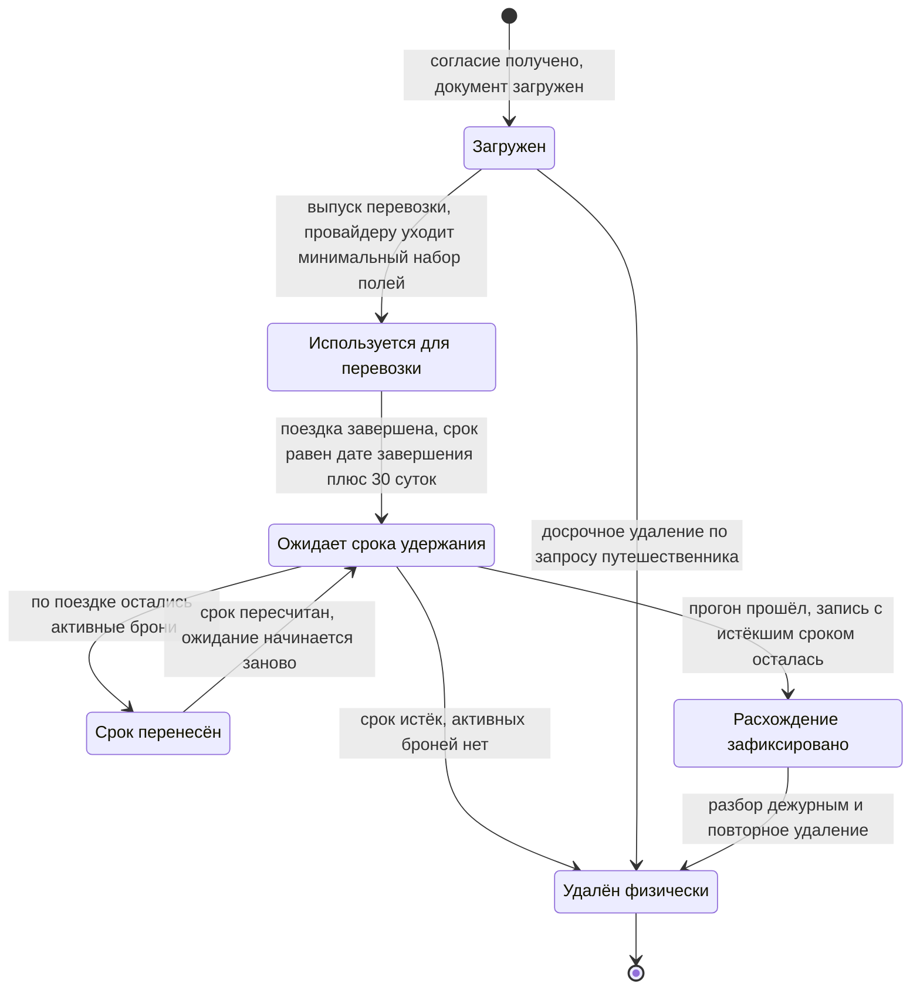

# Жизненный цикл паспортных данных

Постскриптум задания звучит одной строкой: нельзя хранить паспортные данные дольше, чем
необходимо для поездки. Строка выглядит как принцип, но принцип нельзя ни выполнить, ни
проверить. Выполнить можно срок, процедуру и доказательство — эта страница о них.

Процесс, исполняющий описанное здесь, — [P-04](/processes/p04-pii-purge). Структуры
данных — контур `pii` в [модели данных](./erd.md).

## Что именно считается паспортными данными

По глоссарию это данные документа, удостоверяющего личность, необходимые для перевозки:
тип, номер, срок действия, дата рождения, имя латиницей, страна выдачи. Подмножество
персональных данных с самым коротким сроком удержания.

**Граница проведена не по чувствительности, а по сроку жизни.** Имя в интерфейсе, почта и
телефон — тоже персональные данные, но они нужны, пока человек пользуется сервисом, а не
до конца конкретной поездки. Они живут в области поездки и удаляются по другому основанию.

Отдельно про гражданство. В документе оно есть, и в контуре хранится страна выдачи. Но
проверка транзитной визы (`FR-ALT-04`) выполняется сервисом подбора альтернатив, которого
в списке допущенных к контуру нет и быть не должно: доступ выдаётся под конкретную
операцию, а подбор идёт сотни раз в час. Поэтому гражданство как **признак человека**
хранится на путешественнике, вне контура, и сроком удержания не ограничено. Разделение
осознанное: страна гражданства — не реквизит документа, она не меняется при замене
паспорта и не перестаёт быть верной через тридцать суток после поездки.

## Почему отдельное хранилище, а не шифрованное поле в общей базе

Шифрование поля закрывает ровно одну угрозу — чтение дампа — и не даёт ни отдельного
срока жизни, ни отдельного контроля доступа, ни доказательства физического удаления.
Приёмочный чек-лист называет вариант «в основной базе, но зашифрованно» отдельным
способом провалить решение. Разбор вариантов — в [ADR-03](/architecture/adr).

Контур — три контейнера и отдельный инстанс: `C-PII` отдаёт, `C-RETENT` только удаляет и
считает, `C-VAULT` хранит с отдельным ключом. Права разведены так, что удаление и
доказательство удаления выполняет не тот код, который данные отдаёт.

## Стадии

Что происходит на каждой стадии, кроме очевидного из диаграммы: согласие фиксируется
версией текста и временем получения, записи документа без согласия не существует; при
загрузке поля шифруются, отдельно сохраняется маска из последних четырёх цифр; при выпуске
перевозки `C-REBOOK` получает минимальный набор полей (`FR-PII-06`), и переданные значения
не попадают в журналы и трассировки (`NFR-SEC-03`); доступ оператора выдаётся по сбою с
обоснованием не дольше чем на 60 минут; после удаления остаётся `purge_record` —
идентификатор документа, путешественник, когда истёк срок и когда удалено, без
содержимого.

## Кто имеет доступ и на каком основании

| Субъект | Основание | Срок | Что получает |
|---|---|---|---|
| Сервис перебронирования | Включён в список разрешённых сервисов | Постоянно | Минимальный набор полей для выпуска перевозки |
| Планировщик удержания | Включён в список разрешённых сервисов | Постоянно | Только право удалять и считать. Читать содержимое не может |
| Оператор поддержки | Конкретный сбой с указанным обоснованием | Не больше 60 минут, продление — новым обоснованием | Поля документа, необходимые для разбора |
| Путешественник | Собственная запись | Сессия | Свой документ |
| Организатор поездки | Отсутствует | — | Ничего. `FR-PII-02` прямо запрещает |
| Аналитика и витрины | Отсутствует | — | Ничего. `NFR-SEC-03` проверяет это автоматически |

Журнал доступа неизменяем и закрыт для тех, чей доступ он фиксирует (`NFR-SEC-02`).
Оператор поддержки — субъект аудита, а не его читатель. Без этого условия первое требование
не имеет силы: журнал, который может править тот, кого он контролирует, доказательством не
является.

## Как считается срок

**Точка отсчёта — фактическое завершение поездки, а не плановая дата окончания.** Плановая
дата врёт ровно в том случае, ради которого написана вся система: рейс перенесли на сутки,
и поездка закончилась не тогда, когда собирались. Фактическое завершение приходит событием
`trip.completed.v1` — последний сегмент выполнен.

**Тридцать суток — законный срок, а не наша оценка.** 152-ФЗ, ст. 21 ч. 4: оператор
уничтожает персональные данные в срок до 30 дней с даты достижения цели обработки.
Цель здесь — выполненная перевозка. Окно заодно совпадает с тем, в котором ещё
возможны претензия перевозчику, возврат по невыполненному сегменту и разбор спорной
ситуации: для всех трёх нужны данные документа, после — ни для одной.

**Срок хранится в записи, а не вычисляется при запросе.** Вычисляемый срок означал бы, что
дата удаления зависит от того, кто и когда задал вопрос, а перенос срока пришлось бы
выражать поправкой где-то ещё.

## Что происходит, если поездка продлилась

Данные документа нужны, пока по поездке есть хотя бы одна активная бронь. Три типичных
случая: не улетел обратный сегмент, висит незакрытый возврат, не завершено
перебронирование. Поэтому по истечении срока сначала проверяется отсутствие активных
броней, и при их наличии срок переносится.

Альтернатива — удалять по расписанию не глядя — ломает и возврат денег, и повторное
перебронирование: для обеих операций перевозчику нужны данные документа. Формально
требование было бы выполнено, фактически человек остался бы без денег и без билета.

Перенос меняет одно значение в записи. Именно поэтому таймер в `P-04` задан через
`timeDate` от вычисленного срока, а не через `timeDuration` от старта: при переносе
меняется переменная, а не логика ожидания.

## Почему удаление физическое

Пометка «удалено» вместо удаления условие не выполняет: помеченная запись остаётся
записью. Её видно в резервной копии, её достанет разработчик с правами на схему, её
вернёт восстановление. Что из этого следует для модели — в [ERD](./erd.md): признака
удаления нет ни у одной таблицы контура, а у журнала доступа и записи об удалении нет
внешнего ключа на документ, иначе удаление либо блокировалось бы журналом, либо сносило
бы каскадом доказательство.

Отдельно про резервные копии. Восстановление не воскрешает удалённые записи
(`NFR-COMP-01`), и держится это на двух свойствах: срок удержания лежит в самой записи,
поэтому восстановленный документ с истёкшим сроком удаляется ближайшим суточным прогоном,
а восстановление контура сопровождается внеочередным прогоном удаления. Проверяется
учениями по восстановлению.

## Что наружу не выходит

- **Метода, возвращающего полные паспортные данные, во внешнем интерфейсе нет.** Это
  `FR-PII-02` и одновременно ограничение на состав OpenAPI: не «метод есть, но с проверкой
  прав», а метода нет.
- **Наружу отдаются ссылка на запись и маска.** Маска — отдельное поле, а не результат
  расшифровки. Иначе показ карточки бронирования означал бы обращение к контуру и запись в
  журнал доступа, и журнал перестал бы что-либо значить.
- **Паспортные данные не покидают контур** — ни в журналах приложений, ни в трассировках,
  ни в сообщениях шины, ни в аналитических витринах. Проверяется автоматическим поиском по
  шаблонам номеров документов на каждой сборке и еженедельно по промышленным журналам
  (`NFR-SEC-03`).
- **Трансграничная передача — только провайдеру бронирования**, в объёме минимального
  набора полей, с записью в реестре передач (`NFR-COMP-02`).

## Досрочное удаление

`FR-PII-07`: путешественник инициирует удаление своих паспортных данных, и оно выполняется,
если по бронированию нет предстоящей поездки. Отзыв согласия на обработку даёт тот же
результат со сроком 30 суток при том же условии.

Условие не формальное: удалить документ при живом бронировании значит лишить человека
возможности улететь. Поэтому запрос при наличии предстоящей поездки не отклоняется молча —
он ставится в очередь и исполняется по её завершении.

Риски контура и то, чем каждый закрыт, — в [реестре рисков](/risks).
