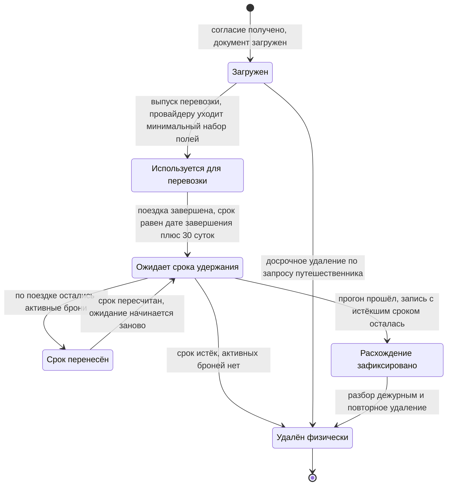

# Жизненный цикл паспортных данных

Постскриптум задания звучит одной строкой: нельзя хранить паспортные данные дольше, чем
необходимо для поездки. Строка выглядит как принцип, но принцип нельзя ни выполнить, ни
проверить. Выполнить можно срок, процедуру и доказательство — эта страница о них.

Процесс, исполняющий описанное здесь, — [P-04](/processes/p04-pii-purge). Структуры
данных — контур `pii` в [модели данных](./erd.md).

## Что именно считается паспортными данными

По глоссарию это данные документа, удостоверяющего личность, необходимые для перевозки:
тип, номер, срок действия, дата рождения, имя латиницей, страна выдачи. Подмножество
персональных данных с самым коротким сроком удержания.

**Граница проведена не по чувствительности, а по сроку жизни.** Имя в интерфейсе, почта и
телефон — тоже персональные данные, но они нужны, пока человек пользуется сервисом, а не
до конца конкретной поездки. Они живут в области поездки и удаляются по другому основанию.

Отдельно про гражданство. В документе оно есть, и в контуре хранится страна выдачи. Но
проверка транзитной визы (`FR-ALT-04`) выполняется сервисом подбора альтернатив, которого
в списке допущенных к контуру нет и быть не должно: доступ выдаётся под конкретную
операцию, а подбор идёт сотни раз в час. Поэтому гражданство как **признак человека**
хранится на путешественнике, вне контура, и сроком удержания не ограничено. Разделение
осознанное: страна гражданства — не реквизит документа, она не меняется при замене
паспорта и не перестаёт быть верной через тридцать суток после поездки.

## Почему отдельное хранилище, а не шифрованное поле в общей базе

Приёмочный чек-лист называет вариант «паспортные данные в основной базе, но зашифрованно»
отдельным способом провалить решение. Причина в том, что шифрование поля закрывает ровно
одну угрозу — чтение дампа — и не закрывает ни одной из остальных:

| Что нужно | Даёт ли шифрованное поле в общей базе |
|---|---|
| Отдельный срок жизни | Нет. Строка живёт столько же, сколько бронирование |
| Отдельный контроль доступа | Нет. Права выдаются на схему, а расшифровка — вопрос доступа к ключу, который есть у сервиса целиком |
| Доказательство физического удаления | Нет. `UPDATE` поля в `NULL` неотличим от «данных не было», а восстановление из копии их вернёт |
| Невозможность случайного выноса | Нет. Поле попадает в `SELECT *`, в аналитическую витрину, в дамп для тестового стенда |

Контур — три контейнера и отдельный инстанс: `C-PII` отдаёт, `C-RETENT` только удаляет и
считает, `C-VAULT` хранит с отдельным ключом. Права разведены намеренно: удаление и
доказательство удаления выполняет не тот код, который данные отдаёт.

## Стадии

| Стадия | Чем начинается | Что происходит | Чем заканчивается |
|---|---|---|---|
| Согласие | Действие путешественника | Фиксируется версия текста согласия и время получения. Записи документа без согласия не существует — это автотест, а не договорённость | Согласие получено |
| Загрузка | Путешественник вводит документ | Поля шифруются, отдельно сохраняется маска — последние четыре цифры. Организатор поездки загрузить документ за участника не может: `FR-PII-02` закрывает ему доступ к паспортным данным участников | Документ в контуре |
| Использование | Выпуск или перевыпуск перевозки | Сервис перебронирования получает минимальный набор полей (`FR-PII-06`). Переданные значения не попадают в журналы приложений и трассировки (`NFR-SEC-03`) | Билет выпущен |
| Доступ оператора | Эскалация сбоя | Доступ выдаётся по конкретному сбою, с обоснованием, на срок не больше 60 минут, прекращается автоматически. Каждое обращение — запись в журнале | Срок доступа истёк |
| Расчёт срока | `trip.completed.v1` | Срок удержания записывается в саму запись документа | Срок известен |
| Ожидание | Таймер `timeDate` от записанного срока | Ничего. Данные лежат и используются только по перечисленным выше основаниям | Срок наступил |
| Проверка и перенос | Срок наступил | Если по поездке остались активные брони, срок переносится и ожидание начинается заново | Активных броней нет |
| Удаление | Активных броней нет | Физическое удаление записи. Не позднее 24 часов после истечения срока | Записи не существует |
| Доказательство | Удаление выполнено | Остаётся запись об удалении: идентификатор документа, путешественник, когда истёк срок, когда удалено. Содержимого в ней нет и не было | Отчёт за период можно построить |
| Сверка | Ежесуточный прогон | Считаются записи с истёкшим сроком, которые не были удалены. Больше нуля — `pii.purge.mismatch.v1` и разбор дежурным | Расхождений нет |

## Кто имеет доступ и на каком основании

| Субъект | Основание | Срок | Что получает |
|---|---|---|---|
| Сервис перебронирования | Включён в список разрешённых сервисов | Постоянно | Минимальный набор полей для выпуска перевозки |
| Планировщик удержания | Включён в список разрешённых сервисов | Постоянно | Только право удалять и считать. Читать содержимое не может |
| Оператор поддержки | Конкретный сбой с указанным обоснованием | Не больше 60 минут, продление — новым обоснованием | Поля документа, необходимые для разбора |
| Путешественник | Собственная запись | Сессия | Свой документ |
| Организатор поездки | Отсутствует | — | Ничего. `FR-PII-02` прямо запрещает |
| Аналитика и витрины | Отсутствует | — | Ничего. `NFR-SEC-03` проверяет это автоматически |

Журнал доступа неизменяем и закрыт для тех, чей доступ он фиксирует (`NFR-SEC-02`).
Оператор поддержки — субъект аудита, а не его читатель. Без этого условия первое требование
не имеет силы: журнал, который может править тот, кого он контролирует, доказательством не
является.

## Как считается срок

**Точка отсчёта — фактическое завершение поездки, а не плановая дата окончания.** Плановая
дата врёт ровно в том случае, ради которого написана вся система: рейс перенесли на сутки,
и поездка закончилась не тогда, когда собирались. Фактическое завершение приходит событием
`trip.completed.v1` — последний сегмент выполнен.

**Тридцать суток — допущение, а не норма из требований заказчика.** Это окно, в котором
ещё возможны претензия перевозчику, возврат по невыполненному сегменту и разбор спорной
ситуации по перевозке. Для всех трёх задач нужны данные документа. По истечении окна они
не нужны ни для одной задачи, которую система выполняет.

**Срок хранится в записи, а не вычисляется при запросе.** Вычисляемый срок означал бы, что
дата удаления зависит от того, кто и когда задал вопрос, а перенос срока пришлось бы
выражать поправкой где-то ещё.

## Что происходит, если поездка продлилась

Данные документа нужны, пока по поездке есть хотя бы одна активная бронь. Три типичных
случая: не улетел обратный сегмент, висит незакрытый возврат, не завершено
перебронирование. Поэтому по истечении срока сначала проверяется отсутствие активных
броней, и при их наличии срок переносится.

Альтернатива — удалять по расписанию не глядя — ломает и возврат денег, и повторное
перебронирование: для обеих операций перевозчику нужны данные документа. Формально
требование было бы выполнено, фактически человек остался бы без денег и без билета.

Перенос меняет одно значение в записи. Именно поэтому таймер в `P-04` задан через
`timeDate` от вычисленного срока, а не через `timeDuration` от старта: при переносе
меняется переменная, а не логика ожидания.

## Почему удаление физическое и чего это стоило модели

Пометка «удалено» вместо удаления не выполняет условие: помеченная запись остаётся
записью. Её видно в резервной копии, её достанет разработчик с правами на схему, её вернёт
восстановление. Три следствия для модели:

**Признака удаления нет ни у одной сущности контура.** Не «не используется», а физически
отсутствует в схеме.

**У журнала доступа и записи об удалении нет внешнего ключа на документ.** Внешний ключ дал
бы выбор из двух одинаково плохих исходов: либо удаление документа блокируется, пока есть
записи журнала, — и данные хранятся дольше срока, либо каскад сносит вместе с документом и
доказательство того, что он был. Идентификатор документа хранится там значением. Журнал
переживает документ и живёт три года.

**Восстановление из резервной копии не воскрешает удалённые записи** (`NFR-COMP-01`).
Обеспечивается двумя свойствами: срок удержания лежит в самой записи, поэтому восстановленный
документ с истёкшим сроком удаляется ближайшим суточным прогоном, а восстановление контура
сопровождается обязательным внеочередным прогоном удаления — записи об удалении
восстанавливаются вместе с документами и содержат всё, что для этого нужно. Проверяется
учениями по восстановлению, а не декларацией.

## Что наружу не выходит

- **Метода, возвращающего полные паспортные данные, во внешнем интерфейсе нет.** Это
  `FR-PII-02` и одновременно ограничение на состав OpenAPI: не «метод есть, но с проверкой
  прав», а метода нет.
- **Наружу отдаются ссылка на запись и маска.** Маска — отдельное поле, а не результат
  расшифровки. Иначе показ карточки бронирования означал бы обращение к контуру и запись в
  журнал доступа, и журнал перестал бы что-либо значить.
- **Паспортные данные не покидают контур** — ни в журналах приложений, ни в трассировках,
  ни в сообщениях шины, ни в аналитических витринах. Проверяется автоматическим поиском по
  шаблонам номеров документов на каждой сборке и еженедельно по промышленным журналам
  (`NFR-SEC-03`).
- **Трансграничная передача — только провайдеру бронирования**, в объёме минимального
  набора полей, с записью в реестре передач (`NFR-COMP-02`).

## Досрочное удаление

`FR-PII-07`: путешественник инициирует удаление своих паспортных данных, и оно выполняется,
если по бронированию нет предстоящей поездки. Отзыв согласия на обработку даёт тот же
результат со сроком 30 суток при том же условии.

Условие не формальность: удалить документ при живом бронировании означает лишить человека
возможности улететь. Поэтому запрос при наличии предстоящей поездки не отклоняется молча —
он ставится в очередь и исполняется по её завершении.

## Чем закрыт каждый риск

| Риск | Чем закрыт |
|---|---|
| Данные хранятся дольше нужного | Срок в записи, таймер `P-04`, ежесуточная сверка, алерт при расхождении |
| Удаление объявлено, но не выполнено | Запись об удалении и отчёт за произвольный период. Отсутствие признака удаления в схеме |
| Данные вернулись из резервной копии | Внеочередной прогон при восстановлении, срок внутри самой записи, учения по восстановлению |
| Доступ без основания | Выданный доступ с обоснованием и сроком, журнал каждого обращения, алерт на обращение вне правил |
| Журнал подделан тем, кого он контролирует | Журнал неизменяем, оператор поддержки не имеет права чтения |
| Данные утекли в журналы или витрины | Автоматический поиск по шаблонам на каждой сборке, ревью схемы витрин |
| Организатор увидел документы участников | Доступа нет на уровне требования и программного интерфейса, а не настройки |
