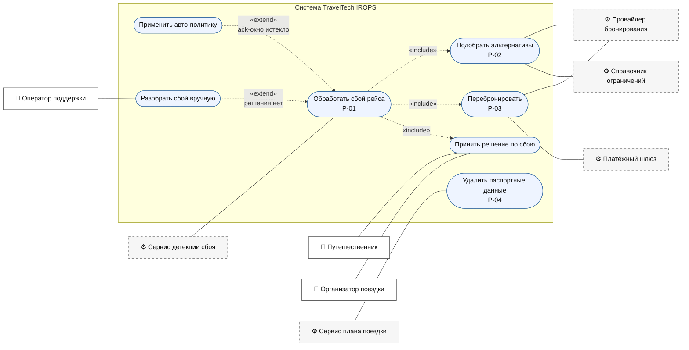

# Карта процессов

Четыре смоделированных процесса и две таблицы решений. Ниже — диаграмма вариантов
использования: кто чего хочет от системы и как варианты связаны между собой. Границы
системы совпадают с границами развёрнутого пула в BPMN.

Сплошные линии — ассоциации актора с вариантом использования, без стрелок: у ассоциации
в UML направления нет. Пунктир со стрелкой — зависимости `«include»` и `«extend»`.
Стрелка `«include»` идёт от базового варианта к включаемому, `«extend»` — наоборот, от
расширяющего к базовому: авто-политика и ручной разбор нужны не всегда, а только при
выполнении условия, и подписаны этим условием.

Актор-человек и системный актор разделены. Сплошной контур — люди с
собственными целями, пунктирный — внешние системы, у которых цели нет: они либо
инициируют сценарий событием, либо вызываются системой.

Инициатор основного сценария — сервис детекции, а не путешественник. Это главное
следствие постановки: процесс начинается с события провайдера, и о сбое пользователь
узнаёт от системы, а не наоборот.

## Процессы

| Процесс | Триггер | Кто вызывает | Что закрывает из задания |
|---|---|---|---|
| [P-01. Обработка сбоя рейса](/processes/p01-disruption) | `disruption.detected.v1` | Сервис детекции | Уведомление о сбое, пользователь оффлайн, групповые поездки |
| [P-02. Подбор альтернатив](/processes/p02-alternatives) | Call activity из `P-01.T2` | P-01 | Багаж, визы, таймзоны; отказы внешних API |
| [P-03. Перебронирование](/processes/p03-rebooking) | Call activity из `P-01.T5` | P-01 | Обновление плана, деньги, отказы внешних API |
| [P-04. Удаление паспортных данных](/processes/p04-pii-purge) | `trip.completed.v1` | Сервис плана поездки | P.S. про паспортные данные |
| [Таблицы решений](/processes/dmn) | Business rule task | P-01, P-02 | Решение за молчащего пользователя |

Поиск и бронирование как процесс не моделировался: ни одно из шести обязательных условий
задания через него не закрывается. Всё, что нужно обработке сбоя, — бронирование с PNR,
план со связями между элементами, состав участников с ролями, плательщик и его согласие
на доплату, паспортные данные с датой завершения поездки и предпочтения по каналам
доставки, — считается уже существующим на момент старта P-01.

## Границы между процессами

Разделение сделано по обратимости и по владельцу данных, а не по размеру диаграммы.

**P-01 и P-02.** У подбора собственный набор внешних систем и собственный режим отказа:
справочник ограничений недоступен — подбор возвращает пустой список, а не роняет обработку
сбоя. Для P-01 «вариантов нет» и «проверки не выполнены» выглядят одинаково, и реакция в
обоих случаях одна.

**P-01 и P-03.** Перебронирование — сага с компенсациями и точкой невозврата. Внутри P-01
она смешала бы в одном экземпляре процесса откатываемые и неоткатываемые шаги. Наружу P-03
отдаёт два исхода: успех либо `REBOOKING_FAILED`.

**P-04 отдельно.** Другой масштаб времени — недели против минут, — другой инициатор и
другой контур хранения. Единственная связь с остальными: пока по поездке есть активная
бронь, срок удержания переносится.

## Соглашения по диаграммам

Все четыре диаграммы — коллаборации: система развёрнутым пулом, внешние акторы свёрнутыми.
Оператор поддержки остался задачей внутри системного пула — он работает в консоли, которая
частью системы и является. Синхронные вызовы внешних систем подписаны обычным текстом
(«Запрос альтернатив»), события шины — именами каналов из
[каталога событий](/api/events).
